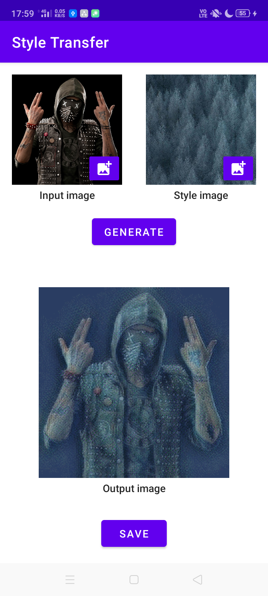

# NeuralStyleTransfer-Android
Neural Style Transfer android app using TFLite

## Screenshot

## Model
The model used in the app is available [here](https://tfhub.dev/google/magenta/arbitrary-image-stylization-v1-256/2)

## Reference
[Style Transfer Android sample](https://github.com/tensorflow/examples/tree/master/lite/examples/style_transfer/android)
